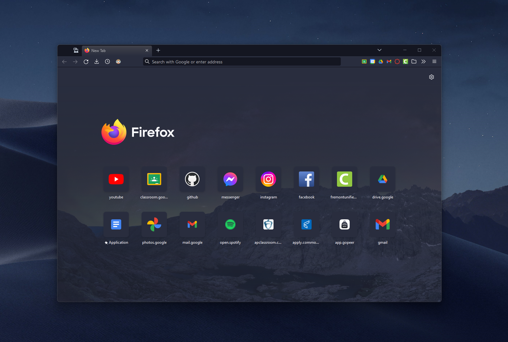
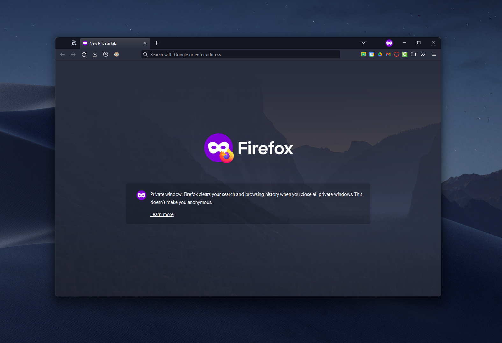

# userChrome.css

Customized Firefox appearance with CSS  

  

## Installation
- Go to about:config, search `toolkit.legacyUserProfileCustomizations.stylesheets`, and set it to `true`  
- Go to about:profiles, then click open folder next to Root Directory
- Open your terminal in the previous folder and run the following command: `git clone https://github.com/benman604/userChrome.css.git chrome`
